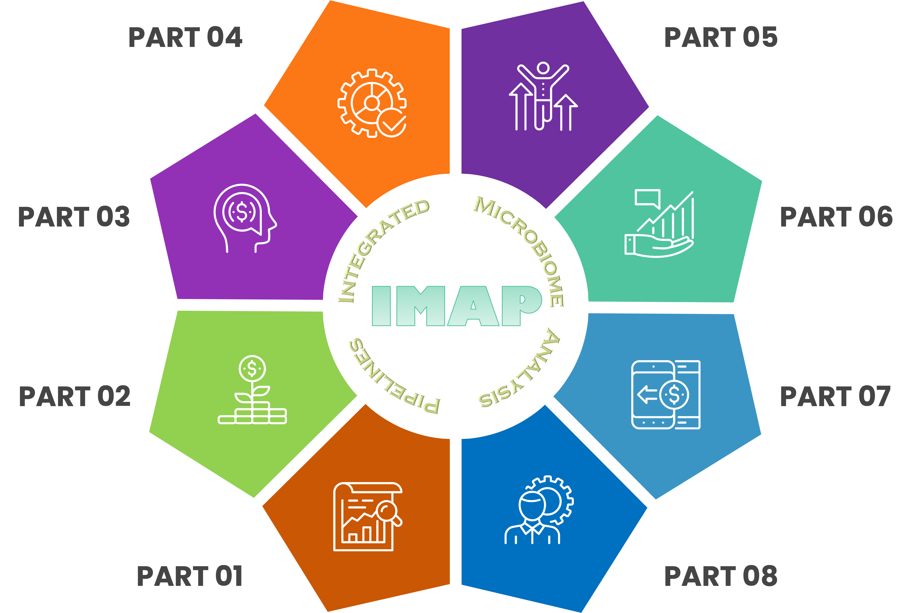
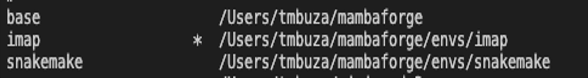

<div id="main-container">

<!-- Google Fonts: https://fonts.google.com/?preview.text=IMAP%20template&preview.text_type=custom-->
<link rel="preconnect" href="https://fonts.googleapis.com">
<link rel="preconnect" href="https://fonts.gstatic.com" crossorigin>
<link href="https://fonts.googleapis.com/css2?family=Anton" rel="stylesheet">
<link href="https://fonts.googleapis.com/css2?family=Roboto:wght@100;300;400;500;700,900&display=swap" rel="stylesheet">
<link href="https://fonts.googleapis.com/css2?family=Oswald:wght@300;400;700&display=swap" rel="stylesheet">
<link href="https://fonts.googleapis.com/css2?family=Merriweather:wght@300;400;700&display=swap" rel="stylesheet">
<link href="https://fonts.googleapis.com/css2?family=Montserrat:wght@100;200;300;400;700&display=swap" rel="stylesheet">

<span class="fas fa-my-custom-icon"></span>


```{r echo=FALSE, message=FALSE, warning=FALSE}
knitr::opts_chunk$set(
  echo  =FALSE,
  message  =FALSE,
  warning  =FALSE,
  cache  =FALSE,
  comment  =NA,
  fig.path='./figures/',
  fig.show='asis',
  dev  ='png',
  fig.align='center',
  out.width  ="70%",
  fig.width  =7,
  fig.asp  =0.7,
  fig.show  ="asis"
)

library(tidyverse, suppressPackageStartupMessages())
library(schtools)
```
# General Overview

## About IMAP
**IMAP** stands for **Integrated Microbiome Analysis Pipelines**. 
Microbiome data analysis is about asking questions to understand the microbial composition in a given sample. 
The IMAP parts are standalone GitHub repositories that, when used sequentially, provide a systematic microbiome data analysis beyond the traditional methods. 

## Workflow system
- We use the snakemake workflow management system [@Koster2021; @Snakemake2023] for:
  - Maintaining reproducibility in technical validation and regeneration of results.
  - Creating scalable data analysis scaled to a server, grid, or cloud environment.
  - Fostering sustainable improvement of the microbiome data analysis.
- We also review existing workflows [@Snakemake2023; @Mothursnakemake] to help gain better insights for improving microbiome data analysis.
- We break any complex workflows into small contiguous but related chunks where each major step forms a separate executable snakemake rule.

## Vision
> We envision to keep fostering continuous integration and continuous improvement of highly reproducible and sustainable workflows for microbiome data analysis.



<br><hr width=100%><br>

# Software Installation

## Environment and package managers
### Install conda
Conda is a package manager and can be obtained via Miniconda or Anaconda.

- For full installation guide click [here](https://conda.io/projects/conda/en/latest/user-guide/install/index.html).
- For documentation click [here](https://docs.conda.io/en/latest/).
- Miniconda: https://docs.conda.io/en/latest/miniconda.html
- Anaconda: https://docs.anaconda.com/
- Getting started with Conda: Click [here](https://docs.conda.io/projects/conda/en/latest/user-guide/getting-started.html).


### Install mamba
> Mamba is a CLI tool to manage conda environments

- Mamba can be obtained via Mambaforge.
- For full installation guide click [here](https://mamba.readthedocs.io/en/latest/installation.html).
- For documentation click [here](https://mamba.readthedocs.io/en/latest/user_guide/mamba.html).


### Demo installing Miniconda3 for Mac OS
```bash
curl -L  https://repo.anaconda.com/miniconda/Miniconda3-latest-MacOSX-x86_64.sh -o Miniconda3-latest-MacOSX-x86_64.sh
bash Miniconda3-latest-MacOSX-x86_64.sh
```
<!-- SnakeDeploy is a command line and interactive Python client to easily deploy snakemake pipelines from version control like GitHub -->


### Demo installing Mambaforge for Mac OS
```bash
curl -L https://github.com/conda-forge/miniforge/releases/latest/download/Mambaforge-MacOSX-x86_64.sh -o Mambaforge-MacOSX-x86_64.sh
bash Mambaforge-MacOSX-x86_64.sh
```

## Setting up common channels
We will be using lots of bioinformatics and analysis tools. 

> - Note that most of the bioinformatics software are installed via `bioconda` channel. 
> - Most of analysis tools are installed via the `conda-forge` channel.
> - Some of the metagenomics analysis software will be installed via `biobakery` channel. 

```bash
conda config --add channels defaults
conda config --add channels bioconda
conda config --add channels conda-forge
conda config --add channels biobakery
conda config --set auto_activate_base False
```

## Creating conda environment
Here we demonstrate:

- How to create an environment named `snakemake`. Replace snakemake with your preferred name!
- How to create an environment named `snakemake` with a specific python version.
- How to create an environment named `snakemake` with a specific python version and specific packages
- How to activate an environment.
- How to deactivate an environment.

### Using conda
```bash
conda create --name snakemake
conda create --name snakemake python==10
conda create --name snakemake python==10 pandas numpy seaborn
```
> Note: Each line of command performs independent task, so choose a method that suits you best.

### Using mamba
```bash
mamba create -c bioconda --name snakemake
mamba create --name snakemake python==10
mamba create --name snakemake python==10 pandas numpy seaborn
```

## Activating and deactivating conda environment
```bash
conda activate snakemake

conda deactivate snakemake
```

> - After setting up the channels and creating an environment we can install more software. 
> - For installation we will be using `Mamba package manager` instead of `Conda package manager` because it is much faster. 


## Install `snakemake` software
- Snakemake is best installed via the Mamba package manager.
- We can also install snakemake via Mambaforge.

### Confirming if conda or mamba is installed
This will display the version of conda installed on your machine.

```bash
conda -V

mamba -V
```

### Keeping conda or mamba up-to-date
It is always a good habit to update conda before major installations.

```bash
conda update conda
conda -V

mamba update conda
mamba -V
```

### Install snakemake software
```bash
mamba install -c bioconda snakemake
```

### Install snakemake minimal
```
mamba install -c bioconda snakemake-minimal
```

### Install snakemake wrappers
```
mamba install -c bioconda snakemake-wrapper-utils
```

## Reproducing existing environment
- Requires an environment `spec` file or a `yaml` file


### Creating an env spec file
```bash
conda list --explicit > env_spec_file.txt
```

### Creating a new environment from a spec file
```bash
conda create --name new_env --file env_spec_file.txt
```

### Installing packages from a spec file
```bash
conda install --name existing_env --file env_spec_file.txt
```

### Creating new env from a YAML file
- First create the YAML or YML file:
  - `environment.yml`
  - `environment.yaml`
- This demo file is saved in `workflow/envs` folder and is configured to contain the following:

```
name: imap
channels:
  - conda-forge
  - bioconda
  - defaults
  - r
dependencies:
  - snakemake =7.19.1
  - snakemake-minimal =7.19.1
  - snakemake-wrapper-utils =0.5.0
  - snakedeploy =0.8.6
  - python =3.11.0
  - r-base =4.1.3
  - r-tidyverse =1.3.2 
  - r-bookdown =0.32
  - r-htmltools =0.5.4 
  - r-htmlwidgets =1.6.1
  - r-leaflet =2.1.1
  - r-leaflet.providers =1.9.0 
  - r-rmarkdown =2.20
  - r-schtools =0.4.0
  - graphviz =6.0.1
```

- Then create the new env, e.g. `imap`, using the `environment.yaml` like so:

```bash
conda activate base
mamba env create --name imap --file workflow/envs/environment.yaml
```

## Check available environments
If everything went smoothly, you should see the newly created environment, ready to be activated. Great!
```bash
mamba env list
```

```bash
conda activate imap
```

## Removing an environment
```bash
conda env list
```


```bash
conda deactivate

conda env remove --name /Users/tmbuza/mambaforge/envs/imap

conda env list
```


```{r child='workflow/scripts/software.Rmd', eval=FALSE}
```

```{r child='workflow/scripts/metadata.Rmd', eval=FALSE}
```

```{r child='workflow/scripts/preprocess_tools.Rmd', eval=FALSE}
```

```{r child='workflow/scripts/sequencing_data.Rmd', eval=FALSE}
```

```{r child='workflow/scripts/bioinfo_pipelines.Rmd', eval=FALSE}
```


<br><hr width=100%><br>


# Related work
```{block imaprepos, echo=TRUE}

| Repo | Description | Summary |
|--------------|----------------------------------|--------------|
| [IMAP-PART1](https://github.com/tmbuza/imap-basic-requirements/) | Getting started with microbiome data analysis | [GH-Pages](https://tmbuza.github.io/imap-basic-requirements/) |
| [IMAP-PART2](https://github.com/tmbuza/imap-sample-metadata/) | Exploring and profiling microbiome sample metadata | [GH-Pages](https://tmbuza.github.io/imap-sample-metadata/) |
| [IMAP-PART3](https://github.com/tmbuza/imap-bioinformatics-analysis/) | Bioinformatics analysis of microbiome data | [GH-Pages](https://tmbuza.github.io/imap-bioinformatics-analysis/) |
| [IMAP-PART4](https://github.com/tmbuza//) |  | [GH-Pages](https://tmbuza.github.io//) |
| [IMAP-PART5](https://github.com/tmbuza//) |  | [GH-Pages](https://tmbuza.github.io//) |
| [IMAP-PART6](https://github.com/tmbuza//) |  | [GH-Pages](https://tmbuza.github.io//) |
| [IMAP-PART7](https://github.com/tmbuza//) |  | [GH-Pages](https://tmbuza.github.io//) |
| [IMAP-PART8](https://github.com/tmbuza//) |  | [GH-Pages](https://tmbuza.github.io//) |
```


## Citation

> Please consider citing the iMAP article [@TMBuza2019] if you find any part of the IMAP practical user guides helpful in your microbiome data analysis.

# References
::: {#refs}
:::

<br><hr width=100%><br>

# Appendix {-}


## Project main tree
```{bash, include=FALSE}
bash workflow/scripts/tree.sh
```

```{bash treeimg}
cat results/project_tree.txt
```

## Screenshot of interactive snakemake report {#smkreport}
> The interactive snakemake html report can be viewed by opening the `report.html` using any compartible browser. You will be able to explore the workflow and the associated statistics. You will also be able to close the left bar to get a better wider view of the display.

```{bash smkrpt, include=FALSE}
snakemake --unlock;
snakemake --report report.html;
hti -H report.html -o images/smkreport;
```

```{bash staticsmk, include=FALSE}
snakemake --report report.html
bash workflow/scripts/smk_html_report.sh
```


## Troubleshooting of FAQs
<ol>
  <li>Question</li>
    <ul>Answer</ul>
  <li>Question</li>
    <ul>Answer</ul>
</ol>


</div> <!-- end main-container -->

<br><hr width=100%><br>

<div id="footer">
Last updated on `r format(Sys.time(), '%B %d, %Y')`.<br>
Github_Repo: `r rmarkdown::metadata$github_repo`.<br>
Repo compiled and maintained by: [`r rmarkdown::metadata$author`](mailto:`r rmarkdown::metadata$email_address`). 
</div>