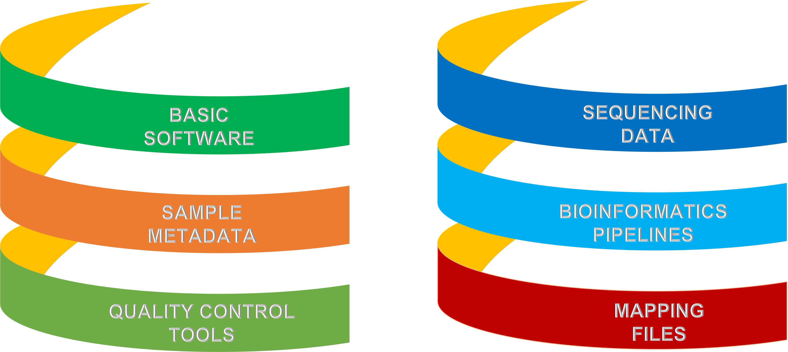
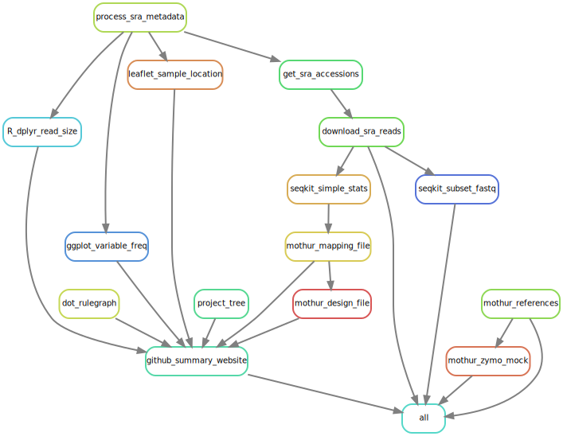

<link rel="preconnect" href="https://fonts.googleapis.com">
<link rel="preconnect" href="https://fonts.gstatic.com" crossorigin>
<link href="https://fonts.googleapis.com/css2?family=Montserrat&display=swap" rel="stylesheet">
<link rel="preconnect" href="https://fonts.googleapis.com/css2?family=Anton&display=swap" rel="stylesheet">

```{r echo=FALSE, message=FALSE, warning=FALSE}
knitr::opts_chunk$set(
  echo = FALSE,
  message = FALSE,
  warning = FALSE,
  cache = FALSE,
  comment = NA,
  fig.path='./figures/',
  fig.show='asis',
  dev = 'png',
  fig.align='center',
  out.width = "70%",
  fig.width = 7,
  fig.asp = 0.7,
  fig.show = "asis"
)

library(tidyverse, suppressPackageStartupMessages())
library(schtools)

```

<br><div id="inprogress"><h2> --- Work In Progress! --- </h2> </div><br><br>

> We continuously review and integrate the old iMAP [@TMBuza2019] with Snakemake and GitHub actions to facilitate reproducible microbiome data analysis!

<br><hr width=100%><br><br><br>

# Basic requirements

<br>



<br><br>


## Snakemake rule DAG

<br><br>

## Screenshot of interactive snakemake report {#smkreport}
> The snakemake html report can be viewed using any compartible browser, such as chrome to explore more on the workflow and the associated statistics. You will be able to close the left bar to get a better wider view of the display.


<br><hr width=50%><br>


# Analysis Software
```{r child='workflow/scripts/software.Rmd'}
```

<br><hr width=50%><br>

# Sample Metadata


```{r child='workflow/scripts/metadata.Rmd'}
```

<br><hr width=50%><br>

# Quality Control Tools

```{r child='workflow/scripts/preprocess_tools.Rmd'}
```

<br><hr width=50%><br>

# Sequencing Data

```{r child='workflow/scripts/sequencing_data.Rmd'}
```

<br><hr width=50%><br>

# Bioinformatics Pipelines

```{r child='workflow/scripts/bioinfo_pipelines.Rmd'}
```

<br><hr width=50%><br>


# References Databases
- Example of reference databases for `Mothur` pipeline.
  - Alignment references
  - Classifiers
  - Taxonomy references
  - Mock references

<br><hr width=50%><br>

# Mapping Files

<!-- ```{r child='workflow/scripts/mapping_files.Rmd'}``` -->

## Mothur sample mapping file
The mapping files are required to direct the pipeline where to look for the files containing the sequencing data.

- The format of the mapping files for `mothur` and `QIIME2` pipelines is slightly different. 
- We will demonstrate how to prepare both.
- Each mapping file will contain only the files that are parsed by bioinformatics analysis. 
- For more detail see Mothur [MiSeq SOP](https://mothur.org/wiki/miseq_sop/).

<br>

## Mothur design file
- Mothur pipeline expects the design (metadata) file to have column headers. 
- We will extract only the desired number of samples.
- The first column header should be **group**.
- For more detail see Mothur [MiSeq SOP](https://mothur.org/wiki/miseq_sop/).

<br><hr width=50%><br><br>

<!-- ################################################### -->
# Appendix
<!-- ################################################### -->

<br>

## Project directories {#dirs}
```{bash}
cat images/project_tree.txt
```

<br><br>

## Troubleshooting (in progress)
<ol>
  <li>CiteprocXMLError: Missing root element</li>
    <ul>
      <li>Maybe the CSL file is empty. Some examples of citation style language are available on Github [@CSL2023].</li>
      <li></li>
    </ul>
  <li>Error from srapath: Error: RC(rcNS,rcNoTarg,rcValidating,rcConnection,rcNotFound)</li>
    <ul>
      <li>This happened when downloading SRA reads from online and it seems to be related to connection issues. Not clear what causes this error but keeping retrying sometimes helps.</li>
      <li>Alternatively, you can download the data using the NCBI-SraToolkits (fasterq-dump is the fastest).</li>
    </ul>
</ol>


<br><br><hr width=50%><br>

## References
::: {#refs}
:::

<br><br><hr width=100%><br>

<div id="footer">
Last updated on `r format(Sys.time(), '%B %d, %Y')`. <br><br>
The snakemake workflow mentioned in this report is continuously being reviewed, integrated, tested and compiled by [`r rmarkdown::metadata$author`](mailto:`r rmarkdown::metadata$email_address`).  
Github_Repo: `r rmarkdown::metadata$github_repo`.  

</div><br><br>
