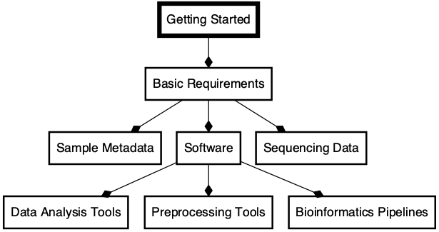

<link rel="preconnect" href="https://fonts.googleapis.com">
<link rel="preconnect" href="https://fonts.gstatic.com" crossorigin>
<link href="https://fonts.googleapis.com/css2?family=Montserrat&display=swap" rel="stylesheet">
<link rel="preconnect" href="https://fonts.googleapis.com/css2?family=Anton&display=swap" rel="stylesheet">


```{css echo = FALSE}
/* #######################################*/
/* #######################################*/
 body{
  font-size: 14px;
  text-align: left;
}
.main-container {
  max-width: 80%;
  background-color: black;
  color: white;
  padding: 3% 3% 3% 3%;
  margin-left: auto;
  margin-right: auto;
}
#header .title big {
  font-size: 1.5em;
  text-transform: capitalize;
  color: black;
  font-family: "Anton", sans-serif;
} 
#header h1{
  font-size: 2.5em;
  text-transform: capitalize;
  color: #1a1a1a;
  font-family: "Anton", sans-serif;
}
#header .subtitle{
  font-size: 1.5em;
  text-transform: capitalize;
  color: #004400;
  font-family: "Anton", sans-serif;
} 

.author{
  display: none;
} 

.date{
  color: #004400;
  font-family: "Anton", sans-serif;
  font-weight: normal:
}
#header {
  background-color: none;
  color: black;
  font-family: "Montserrat", sans-serif;
  text-align: center;
  width: 100%;
  padding: 5%;
  text-transform: none;
  font-weight: bold;
  background-image: url("../images/bkgd1.png");
  /* background-image: url("../images/bkgd2.png"); */
  background-repeat: no-repeat;
  height: 100%; /* You must set a specified height */
  background-position: center; /* Center the image */
  background-size: cover; /* Resize the background image to cover the entire container */
}

body h1{
  font-size: 2.5em;
  text-transform: capitalize;
font-family: "Anton", sans-serif;
}
#header h3{
  font-size: 1.8em;
  color: black;
  text-transform: capitalize;
} 
#header img{
width:75%;
}

/* ############
# BODY CSS
############ */

table tbody tr td {
  font-size: 14px;
  text-transform: capitalize;
}
body img{
  width: 100%;
  display: block;
  margin-left: auto;
  margin-right: auto;
  padding: 20px, 50px, 20px, 50px;
}
blockquote {
    padding: 10px 20px;
    margin: 0 0 20px;
    font-size: 16px;
    border-left: 5px solid #eee;
}

a{
  color: #6bb7f5;
}
#tablefield {
  max-width: 80%;
  margin-left: auto;
  margin-right: auto;
}
hr {
  display: inline-block;
  text-align: left;
  margin: 0px;
  color: #AAAAAA;
}


#appendix img{
  width: 75%;
}
.DiagrammeR, .mermaid{
  display: block;
  margin-left: auto;
  margin-right: auto;
  text-align: center;
}
.DiagrammeR rect, .mermaid rect{
  display: block;
  margin-left: auto;
  margin-right: auto;
  text-align: center;
}
.DiagrammeR svg, .mermaid svg{


.node text {
font-family: 'trebuchet ms', verdana, arial;
font-size: 14px;
}
.DiagrammeR .mermaid{
position: absolute;
text-align: center;
max-width: 200px;
padding: 2px;
font-family: 'trebuchet ms', verdana, arial;
font-size: 12px;
background: #ffff00;
border: 1px solid #aaaa33;
border-radius: 2px;
pointer-events: none;
z-index: 100;
}

/* #######################################*/
/* #######################################*/
@media only screen and (max-width: 768px) {
  .main-container {
  max-width: 100%;
  padding: 1% 1% 1% 1%;
  margin-left: auto;
  margin-right: auto;
  }
  #header h1{
    font-size: 2em;
    text-transform: capitalize;
    color: #1a1a1a;
    font-family: "Anton", sans-serif;
  body {
    font-size: 12px;
    width: 100%; 
  } 
  #footer {
    text-align: left;
    font-size: 1.1em;
  } 

  #tablefield {
  width: 100%;
  margin-left: auto;
  margin-right: auto;
} 
body h1{
  font-size: 2.5em;
  text-transform: capitalize;
  font-family: "Anton", sans-serif;
}
body h2{
  font-size: 1.8em;
}

body h3{
  font-size: 1.6em;
}

#tablefield h2{
  font-size: 1.6em;
}
}
```

```{r echo=FALSE, message=FALSE, warning=FALSE}
source("workflow/scripts/common.R")
knitr::opts_chunk$set(
  echo = FALSE,
  message = FALSE,
  warning = FALSE,
  cache = FALSE,
  comment = NA,
  fig.path='./figures/',
  fig.show='asis',
  dev = 'png',
  fig.align='center',
  out.width = "70%",
  fig.width = 7,
  fig.asp = 0.7,
  fig.show = "asis"
)

library(tidyverse, suppressPackageStartupMessages())
library(mikropml)
library(schtools)

```

<br><hr><br>

<div id="title">
# Basic requirements

GitHub Repo: https://github.com/tmbuza/imap-bioinformatics

</div>

<br><br>

"

<br><br>

## Snakemake rulegraph


<br><br>

## Project directories
```{bash}
cat project_tree.txt
```

<br><br>

```{r child='workflow/scripts/01a_basic_software.Rmd'}
```

<br><hr><br>

# Sample metadata

## What is metadata?
* <b>Metadata</b> is a set of data that describes and provides information about other data. It is commonly defined as **data about data**.
* **Sample metadata** described in this book refers to the description and context of the individual sample collected for a specific microbiome study.

## Metadata structure
* Metadata collected at different stages (Figure 1) are typically organized in an Excel or Google spreadsheet where:
  * The metadata table columns represent the properties of the samples.
  * The metadata table rows contain information associated with the samples.
  * Typically, the first column of sample metadata is Sample ID, which designates the key associated to individual sample
  * Sampl ID must be unique.

## Embedded metadata
* In most cases, you will find the metadata detached from the experimental data.
* Embedded metadata integrates the experimental data especially for graphics.
* Major microbiome analysis platforms require sample metadata, commonly referred to as **mapping file** when performing downstream analysis.


## Downloading metadata from NCBI-SRA
Typically, after sequencing the microbiome DNA, the investigators are encouraged to deposit the sequence reads in a public repository. The Sequence Read Archive (SRA) is currently the best bioinformatics database for read information. The good thing about SRA is that it integrates data from the NCBI, the European Bioinformatics Institute (EBI), and the DNA Data Bank of Japan (DDBJ). 

<br><br>

## Sample distribution
This demo uses metadata associated with the bushmeat microbiome bioproject number [PRJNA477349](https://www.ncbi.nlm.nih.gov/sra?linkname=bioproject_sra_all&from_uid=477349).
 The metadata and the `run` accessions are available via the [SRA database](https://www.ncbi.nlm.nih.gov/Traces/study/?WebEnv=MCID_63d94ddd2805b915ba189567&query_key=1&GALAXY_URL=https%3A%2F%2Fusegalaxy.org%2Ftool_runner%3Ftool_id%3Dsra_source).
```{r}
source("workflow/scripts/common.R")
library(tidyverse, suppressPackageStartupMessages())

metadata <- read_csv("data/metadata/SraRunTable.csv", show_col_types = FALSE) %>%  
  rename_all(tolower) %>% 
  rename(sample_id = run) %>% 
  drop_na(lat_lon) %>% 
  mutate(
    geo_loc_name = str_replace_all(geo_loc_name, "Tanzania: ", ""),
    geo_loc_name = str_replace_all(geo_loc_name, "The Greater Serengeti Ecosystem", "Serengeti"),
    geo_loc_name = str_replace_all(geo_loc_name, " Ecosystem", ""),
    isolate = str_replace_all(isolate, "_\\d*$", ""),
    lat_lon = str_replace_all(lat_lon, " E$", ""),
    latitude = as.numeric(str_replace_all(lat_lon, " S.*", "")) * -1,
    longitude = as.numeric(str_replace_all(lat_lon, ".*S ", ""))) %>% 
  rename(ecosystem = geo_loc_name) %>%
  rename(description = host) %>% 
  mutate(bases = round(bases/1E6, digits = 0)) %>% 
  select(sample_id, ecosystem, isolate, latitude, longitude, milionbases=bases, description)
  
  write_csv(metadata, "data/metadata/metadata.csv")
```

### Getting read size by variables
```{r echo=TRUE}
metadata %>% 
  select(isolate, ecosystem, milionbases) %>% 
  arrange(milionbases)
```

<br>

### Graphical read size distribution
```{r}
  metadata %>% 
  ggplot(aes(x = isolate, y = milionbases, fill = ecosystem)) +
  facet_grid(~ ecosystem) +
  geom_col(position = "dodge") +
  coord_flip() +
  labs(x = "Animal Name", y = "Read size (milion bases)") +
  theme_light()

ggsave(file="images/variables.png", width=10, height=10)
ggsave(file="images/variables.svg", width=10, height=10)
```
<br><br>

## Location of samples
```{r}
library(leaflet)
# library(leaflet.esri)
library(leaflet.providers)
# library(leaflet.extras)
# library(data.table)
library(htmlwidgets)
library(webshot)
library(mapview)

minLat <- min(metadata$latitude) - 1
minLon <- min(metadata$longitude) + 0
maxLat <- max(metadata$latitude) + .5
maxLon <- max(metadata$longitude) + 0

m <- metadata %>%
  leaflet() %>% 
  addProviderTiles(providers$Esri.NatGeoWorldMap) %>%
  fitBounds(minLon, minLat, maxLon, maxLat) %>%
  addMarkers(lng = ~longitude, lat = ~latitude, popup = ~isolate, label = ~ c(isolate)) %>%
  addCircles(color="magenta", radius = log1p(metadata$longitude) * 10)

## save html to png
saveWidget(m, "images/sample_gps.html", selfcontained = FALSE)
webshot("images/sample_gps.html", file = "images/sample_gps.png",
        cliprect = "viewport")
```

<br><hr><br>

# Appendix

## Troubleshooting (in progress)
<ol>
  <li></li>
    <ul></ul>.
  <li></li>
    <ul></ul>
</ol>

<br><br>

## References
::: {#refs}
:::

<br><br><hr width=50%><br>

<div id="footer">
Last updated on `r format(Sys.time(), '%B %d, %Y')`. <br><br>
These workflows are continuously reviewed, integrated, tested and compiled by [`r rmarkdown::metadata$author`](mailto:`r rmarkdown::metadata$email_address`).  
Github_Repo: `r rmarkdown::metadata$github_repo`.  
Github_Page (this document): `r rmarkdown::metadata$github_page`.  
Visit the [Complex Data Insights (CDI) website](`r rmarkdown::metadata$related_website`) for more practical user guides (...in progress).  
</div><br><br>
