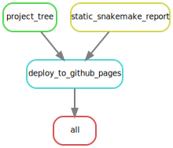

<h4>Github_Repo: `r rmarkdown::metadata$github_repo`. </h4> 


<link rel="preconnect" href="https://fonts.googleapis.com">
<link rel="preconnect" href="https://fonts.gstatic.com" crossorigin>
<link href="https://fonts.googleapis.com/css2?family=Montserrat&display=swap" rel="stylesheet">
<link rel="preconnect" href="https://fonts.googleapis.com/css2?family=Anton&display=swap" rel="stylesheet">

```{css echo = FALSE}
/* #######################################*/
/* #######################################*/
 body{
  font-size: 14px;
  text-align: left;
}
.main-container {
  max-width: 80%;
  background-color: black;
  color: white;
  padding: 3% 3% 3% 3%;
  margin-left: auto;
  margin-right: auto;
}
#header .title big {
  font-size: 1.5em;
  text-transform: capitalize;
  color: black;
  font-family: "Anton", sans-serif;
} 
#header h1{
  font-size: 2.5em;
  text-transform: capitalize;
  color: #1a1a1a;
  font-family: "Anton", sans-serif;
}
#header .subtitle{
  font-size: 1.5em;
  text-transform: capitalize;
  color: #004400;
  font-family: "Anton", sans-serif;
} 

.author{
  display: none;
} 

.date{
  color: #004400;
  font-family: "Anton", sans-serif;
  font-weight: normal:
}
#header {
  background-color: none;
  color: black;
  font-family: "Montserrat", sans-serif;
  text-align: center;
  width: 100%;
  padding: 5%;
  text-transform: none;
  font-weight: bold;
  background-image: url("../images/bkgd1.png");
  /* background-image: url("../images/bkgd2.png"); */
  background-repeat: no-repeat;
  height: 100%; /* You must set a specified height */
  background-position: center; /* Center the image */
  background-size: cover; /* Resize the background image to cover the entire container */
}

body h1{
  font-size: 2.5em;
  text-transform: capitalize;
font-family: "Anton", sans-serif;
}
#header h3{
  font-size: 1.8em;
  color: black;
  text-transform: capitalize;
} 
#header img{
width:75%;
}

/* ############
# BODY CSS
############ */

table tbody tr td {
  font-size: 14px;
  text-transform: capitalize;
}
body img{
  width: 100%;
  display: block;
  margin-left: auto;
  margin-right: auto;
  padding: 20px, 50px, 20px, 50px;
}
blockquote {
    padding: 10px 20px;
    margin: 0 0 20px;
    font-size: 16px;
    border-left: 5px solid #eee;
}

a{
  color: #6bb7f5;
}
#tablefield {
  max-width: 80%;
  margin-left: auto;
  margin-right: auto;
}
hr {
  display: inline-block;
  text-align: left;
  margin: 0px;
  color: #AAAAAA;
}


#appendix img{
  width: 75%;
}
.DiagrammeR, .mermaid{
  display: block;
  margin-left: auto;
  margin-right: auto;
  text-align: center;
}
.DiagrammeR rect, .mermaid rect{
  display: block;
  margin-left: auto;
  margin-right: auto;
  text-align: center;
}
.DiagrammeR svg, .mermaid svg{


.node text {
font-family: 'trebuchet ms', verdana, arial;
font-size: 14px;
}
.DiagrammeR .mermaid{
position: absolute;
text-align: center;
max-width: 200px;
padding: 2px;
font-family: 'trebuchet ms', verdana, arial;
font-size: 12px;
background: #ffff00;
border: 1px solid #aaaa33;
border-radius: 2px;
pointer-events: none;
z-index: 100;
}

/* #######################################*/
/* #######################################*/
@media only screen and (max-width: 768px) {
  .main-container {
  max-width: 100%;
  padding: 1% 1% 1% 1%;
  margin-left: auto;
  margin-right: auto;
  }
  #header h1{
    font-size: 2em;
    text-transform: capitalize;
    color: #1a1a1a;
    font-family: "Anton", sans-serif;
  body {
    font-size: 12px;
    width: 100%; 
  } 
  #footer {
    text-align: left;
    font-size: 1.1em;
  } 

  #tablefield {
  width: 100%;
  margin-left: auto;
  margin-right: auto;
} 
body h1{
  font-size: 2.5em;
  text-transform: capitalize;
  font-family: "Anton", sans-serif;
}
body h2{
  font-size: 1.8em;
}

body h3{
  font-size: 1.6em;
}

#tablefield h2{
  font-size: 1.6em;
}
}
```

```{r echo=FALSE, message=FALSE, warning=FALSE}
source("workflow/scripts/common.R")
knitr::opts_chunk$set(
  echo = FALSE,
  message = FALSE,
  warning = FALSE,
  cache = FALSE,
  comment = NA,
  fig.path='./figures/',
  fig.show='asis',
  dev = 'png',
  fig.align='center',
  out.width = "70%",
  fig.width = 7,
  fig.asp = 0.7,
  fig.show = "asis"
)

library(tidyverse, suppressPackageStartupMessages())
library(mikropml)
library(schtools)

```


# General Overview

- We use the snakemake workflow management system [@Koster2021; @Snakemake2023] for:
  - Maintaining reproducibility in technical validation and regeneration of results
  - Creating scalable data analysis scaled to server, grid or cloud environment seamlessly.
  - Fostering sustainable improvement of the microbiome data analysis.
- Reviewing existing workflows methodlogies [@Snakemake2023; @Mothursnakemake] helps in gaining a better insights for improving microbiome data analysis.
- We break any complex workflows into small contiguous but related chunks for simplicity reasons.
- Each major step forms a separate executable snakemake rule and is represented in the DAG (Directed Acyclic Graph).

<br>

> We envision to keep fostering on continuous integration and development of highly reproducible workflows.


<br><hr width=100%><br>

# Basic requirements


<br><br>

## Snakemake rule DAG


<br><hr width=100%><br>

# Basic Software
```{r child='workflow/scripts/01a_basic_software.Rmd'}
```

<br><hr width=100%><br>

# Sample metadata
```{r child='workflow/scripts/01b_samplemetadata.Rmd'}
```

<br><hr width=100%><br>

<!-- #  -->
```{r eval=FALSE, child='workflow/scripts/.Rmd', include=FALSE}
```

<br><hr width=100%><br>

<!-- #  -->
```{r eval=FALSE, child='workflow/scripts/.Rmd', include=FALSE}
```

<br><hr width=100%><br>

<!-- #  -->
```{r eval=FALSE, child='workflow/scripts/.Rmd', include=FALSE}
```

<br><hr width=100%><br>

<!-- #  -->
```{r eval=FALSE, child='workflow/scripts/.Rmd', include=FALSE}
```

<br><hr width=100%><br>

# Appendix
<br><br>

## Project directories
```{bash}
cat project_tree.txt
```


## Troubleshooting (in progress)
<ol>
  <li></li>
    <ul></ul>.
  <li></li>
    <ul></ul>
</ol>

<br><br>

## References
::: {#refs}
:::

<br><br><hr width=50%><br>

<div id="footer">
Last updated on `r format(Sys.time(), '%B %d, %Y')`. <br><br>
These workflows are continuously reviewed, integrated, tested and compiled by [`r rmarkdown::metadata$author`](mailto:`r rmarkdown::metadata$email_address`).  
Github_Repo: `r rmarkdown::metadata$github_repo`.  
Github_Page (this document): `r rmarkdown::metadata$github_page`.  
Visit the [Complex Data Insights (CDI) website](`r rmarkdown::metadata$related_website`) for more practical user guides (...in progress).  
</div><br><br>
