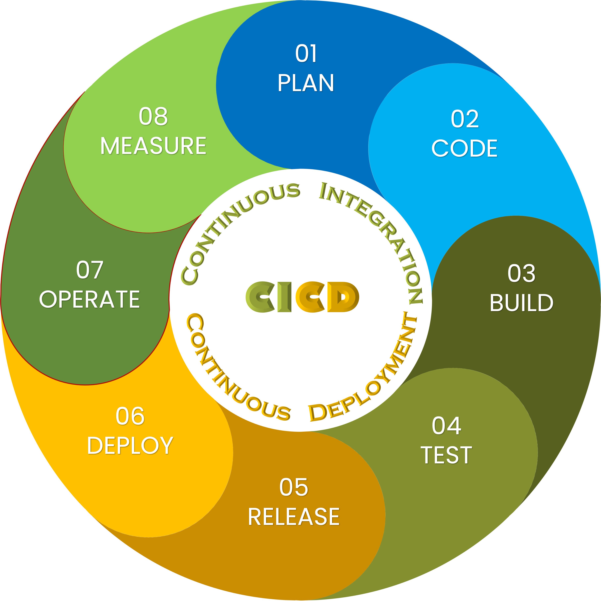

<div id="main-container">

<!-- Google Fonts: https://fonts.google.com/?preview.text=IMAP%20template&preview.text_type=custom-->
<link rel="preconnect" href="https://fonts.googleapis.com">
<link rel="preconnect" href="https://fonts.gstatic.com" crossorigin>
<link href="https://fonts.googleapis.com/css2?family=Anton" rel="stylesheet">
<link href="https://fonts.googleapis.com/css2?family=Roboto:wght@100;300;400;500;700,900&display=swap" rel="stylesheet">
<link href="https://fonts.googleapis.com/css2?family=Oswald:wght@300;400;700&display=swap" rel="stylesheet">
<link href="https://fonts.googleapis.com/css2?family=Merriweather:wght@300;400;700&display=swap" rel="stylesheet">
<link href="https://fonts.googleapis.com/css2?family=Montserrat:wght@100;200;300;400;700&display=swap" rel="stylesheet">

<span class="fas fa-my-custom-icon"></span>


```{r echo=FALSE, message=FALSE, warning=FALSE}
knitr::opts_chunk$set(
  echo = FALSE,
  message = FALSE,
  warning = FALSE,
  cache = FALSE,
  comment = NA,
  fig.path='./figures/',
  fig.show='asis',
  dev = 'png',
  fig.align='center',
  out.width = "70%",
  fig.width = 7,
  fig.asp = 0.7,
  fig.show = "asis"
)

library(tidyverse, suppressPackageStartupMessages())
library(schtools)
```
# General Overview
**IMAP** stands for **Integrated Microbiome Analysis Pipelines**. 
Microbiome data analysis is about asking questions to understand the microbial composition in a given sample. 
The IMAP parts are standalone GitHub repositories that, when used sequentially, provide practical user guides for systematic microbiome data analysis beyond the traditional analysis. 

# Getting started
- We use the snakemake workflow management system [@Koster2021; @Snakemake2023] for:
  - Maintaining reproducibility in technical validation and regeneration of results.
  - Creating scalable data analysis scaled to a server, grid, or cloud environment.
  - Fostering sustainable improvement of the microbiome data analysis.
- We also review existing workflows [@Snakemake2023; @Mothursnakemake] to help gain better insights for improving microbiome data analysis.
- We break any complex workflows into small contiguous but related chunks where each major step forms a separate executable snakemake rule.

<br>

> We envision to keep fostering continuous integration and development of highly reproducible workflows.



<br><br>


## Install conda
Useful links:

- Installation: Visit [here](https://conda.io/projects/conda/en/latest/user-guide/install/index.html).
- Documentation: Visit [here](https://docs.conda.io/en/latest/).
- Miniconda: https://docs.conda.io/en/latest/miniconda.html
- Getting started with Conda: Click [here](https://docs.conda.io/projects/conda/en/latest/user-guide/getting-started.html).

## Install mamba
> Mamba is a CLI tool to manage conda s environments

- Installation: Visit [here](https://mamba.readthedocs.io/en/latest/installation.html).
- Documentation: Visit [here](https://mamba.readthedocs.io/en/latest/user_guide/mamba.html).


### Demo installing on MAC OS
Miniconda3 for `conda`: On CLI run:
```bash
curl -L  https://repo.anaconda.com/miniconda/Miniconda3-latest-MacOSX-x86_64.sh -o Miniconda3-latest-MacOSX-x86_64.sh
bash Miniconda3-latest-MacOSX-x86_64.sh
```

<br>

Mambaforge for `mamba`: On CLI run:
```bash
curl -L https://github.com/conda-forge/miniforge/releases/latest/download/Mambaforge-MacOSX-x86_64.sh -o Mambaforge-MacOSX-x86_64.sh
bash Mambaforge-MacOSX-x86_64.sh
```

## Setting up common channels
We will be using lots of bioinformatics and analysis tools. 

> - Note that most of the bioinformatics software are installed via `bioconda` channel. 
> - Most of analysis tools are installed via the `conda-forge` channel.
> - Some of the metagenomics analysis software will be installed via `biobakery` channel. 

```bash
conda config --add channels defaults
conda config --add channels bioconda
conda config --add channels conda-forge
conda config --add channels biobakery
conda config --set auto_activate_base False
```

## Create environment 
- Requires `conda`.
- You may optionally specify a `python version`.
- Let's create an environment named `snakemake`.

### Is conda installed?
```bash
conda -V
```

### Is conda up to date??
```bash
conda update conda
```


```bash
conda create --name snakemake python==10
```

## Reproduce an existing environment
- Must create env spec file, like so:

```bash
conda list --explicit > spec-file.txt
```

- Then create the environment using the file like so:
```bash
conda create --name snakemake --file spec-file.txt
```

## Installing from a typical YAML file
Example: `environment.yml` also similar to `environment.yaml`

```
name: snakemake
channels:
  - defaults
  - anaconda
dependencies:
  - python==3.10
  - pandas
  - pip:
    - scikit-learn
    - pillow

```

```bash
mamba env create --name snakemake --file environment.yaml
```


```{r child='workflow/scripts/software.Rmd', eval=FALSE}
```


```{r child='workflow/scripts/metadata.Rmd', eval=FALSE}
```

```{r child='workflow/scripts/preprocess_tools.Rmd', eval=FALSE}
```

```{r child='workflow/scripts/sequencing_data.Rmd', eval=FALSE}
```

```{r child='workflow/scripts/bioinfo_pipelines.Rmd', eval=FALSE}
```

<br><hr width=100%><br>

# References Databases
- Example of reference databases for `Mothur` pipeline.
  - Alignment references
  - Classifiers
  - Taxonomy references
  - Mock references

<br><hr width=100%><br>


# Related work
```{block imaprepos, echo=TRUE}

> Here we show the IMAP Repos integrated with Snakemake and GitHub Actions!

<br> 

| Repo | Description | Summary |
|--------------|----------------------------------|--------------|
| [IMAP-PART1](https://github.com/tmbuza/imap-basic-requirements/) | Preparing for microbiome data analysis | [GH-Pages](https://tmbuza.github.io/imap-basic-requirements/) |
| [IMAP-PART2](https://github.com/tmbuza/imap-sample-metadata/) | Exploring and profiling microbiome sample metadata | [GH-Pages](https://tmbuza.github.io/imap-sample-metadata/) |
| [IMAP-PART3](https://github.com/tmbuza/imap-bioinformatics-analysis/) | Bioinformatics analysis of microbiome data | [GH-Pages](https://tmbuza.github.io/imap-bioinformatics-analysis/) |
| [IMAP-PART4](https://github.com/tmbuza//) |  | [GH-Pages](https://tmbuza.github.io//) |
| [IMAP-PART5](https://github.com/tmbuza//) |  | [GH-Pages](https://tmbuza.github.io//) |
| [IMAP-PART6](https://github.com/tmbuza//) |  | [GH-Pages](https://tmbuza.github.io//) |
| [IMAP-PART7](https://github.com/tmbuza//) |  | [GH-Pages](https://tmbuza.github.io//) |
| [IMAP-PART8](https://github.com/tmbuza//) |  | [GH-Pages](https://tmbuza.github.io//) |
```


## Citation

> Please consider citing the iMAP article [@TMBuza2019] if you find any part of the IMAP practical user guides helpful in your microbiome data analysis.

<br><br>

# References
::: {#refs}
:::

<br><hr width=100%><br>

# Appendix {-}

## Project main tree
```{bash, include=FALSE}
bash workflow/scripts/tree.sh
```

```{bash treeimg}
cat results/project_tree.txt
```

<br><br>


## Screenshot of interactive snakemake report {#smkreport}
> The interactive snakemake html report can be viewed by opening the `report.html` using any compartible browser. You will be able to explore the workflow and the associated statistics. You will also be able to close the left bar to get a better wider view of the display.

```{bash smkrpt, include=FALSE}
snakemake --unlock;
snakemake --report report.html;
hti -H report.html -o images/smkreport;
```

```{bash staticsmk, include=FALSE}
snakemake --report report.html
bash workflow/scripts/smk_html_report.sh
```


<br><br>

## Troubleshooting of FAQs
<ol>
  <li>Question</li>
    <ul>Answer</ul>
  <li>Question</li>
    <ul>Answer</ul>
</ol>


<br><br>

</div> <!-- end main-container -->


<div id="footer">
Last updated on `r format(Sys.time(), '%B %d, %Y')`. <br><br>
Github_Repo: `r rmarkdown::metadata$github_repo`.  
Repo compiled and maintained by: [`r rmarkdown::metadata$author`](mailto:`r rmarkdown::metadata$email_address`).  


</div><br><br>